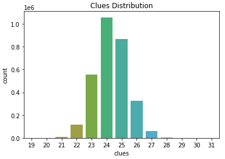
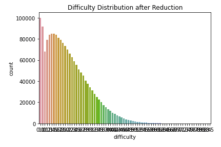
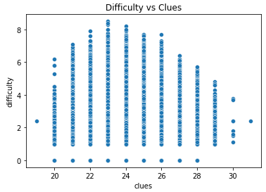

# Abstract

&nbsp;&nbsp;&nbsp;&nbsp;
This paper attempts to analyze the key factors that contribute to the difficulty of Sudoku puzzles using data mining and machine learning techniques.
Understanding the contributing factors to Sudoku difficulty may lead to a deeper knowledge and understanding of other similar puzzles that may be applied to the real world in the future.
We applied a variety of machine learning techniques, but unfortunately, as is often the case in real-world problems, our experiments did not produce the results we desired.
We found that data mining and machine learning techniques were unable to uncover the complex relationship between the puzzles and their difficulties and that this task is better suited for traditional, sudoku-specific algorithms.
The source code for this paper can be found here: https://github.com/ryantran2165/sudoku-difficulty.

# Introduction

&nbsp;&nbsp;&nbsp;&nbsp;
Sudoku, dating all the way back to the 19th century, is one of the world's most famous and popular logic-based puzzles.
The objective in Sudoku is to complete a 9x9 grid of numbers, from one to nine, such that each row, column, and each of the nine 3x3 subgrids contain each digit exactly once.
The puzzle begins in a partially completed state with pre-filled digits or "clues" as we call them in this paper.
Sudoku puzzles each have a single unique solution, and the difficulty in finding such a solution varies wildly from absolutely trivial to seemingly impossible.

&nbsp;&nbsp;&nbsp;&nbsp;
We will be using a Kaggle dataset that provides us with three million samples, each with four features: puzzle, solution, clues, and difficulty.
We are given the puzzle as a string of 81 characters representing the 81 possible grid cells.
Initial clues are given as their respective numerical digit and unknown values to be discovered are represented with a period character.
We are also provided with the solution of the puzzle, though in this case, we will not be utilizing it for our purposes.
Another possibly useful piece of information is the number of initial clues, which we will be extensively analyzing for possible insights.
Lastly, we are given the estimated difficulty of the puzzle.
Sudoku difficulty is not an objective measure, since there are so many different rating systems.
For this dataset, the difficulty was calculated based on the average depth of search trees over ten attempts.

&nbsp;&nbsp;&nbsp;&nbsp;
In this paper, we will utilize a variety of statistical methods from statistics, data mining, and machine learning in an attempt to uncover insights into the key determining factors of Sudoku puzzle difficulty.
More specifically, we will be taking a closer look at how the number of missing values, the values of the digits themselves, and the structure of such values affect the difficulty of the Sudoku puzzles.

# Methods

### Clues Distribution

&nbsp;&nbsp;&nbsp;&nbsp;
First, we will look at the distribution of the number of clues.
From Figure 1, we can see that the number of clues is somewhat normally distributed and centered at around 24 clues.
The vast majority of clues are between 23 and 26.

### Difficulty Distribution

&nbsp;&nbsp;&nbsp;&nbsp;
Next, we look at the distribution of difficulties.
We notice that the distribution is extremely right skewed due to there being so many samples of 0.0 difficulty, puzzles on the easier spectrum.
There are over one million samples of 0.0 difficulty, while the next most common difficulty of 1.0 had about 90,000 samples.
We decided to reduce this discrepancy by randomly sampling 100,000 of the 1,000,000 samples of 0.0 difficulty.
Though after the reduction, the difficulty distribution is still rather right skewed as seen in Figure 2.

### Difficulty-Clues Relationship with Linear Regression and Random Forests

&nbsp;&nbsp;&nbsp;&nbsp;
Next, we attempt to uncover the relationship between the number of clues and difficulty.
As seen in Figure 3, there is not a clear-cut relationship between the number of clues and difficulty.
We somewhat expected the relationship to clearly indicate that more clues would result in lower difficulty, but the plot says otherwise.
However, it can be noted that there is something to be said about the relationship between maximum difficulty and the number of clues.
What's surprising is that this relationship is not monotonic.
It seems the number of clues that results in the maximum difficulty is 23.
Then, the maximum difficulty decreases as you either increase above or decrease below 23 clues.
We then trained a linear regression model and a random forest model using the number of clues to try and predict difficulty.
As expected, we were unable to fit such models and resulted in R squared values of nearly zero, indicating that the models were completely unable to fit the data.
Thus, it is highly likely that the number of clues alone is not a good predictive independent variable for the dependent difficulty variable.

### Puzzle-Clues Relationship with Vanilla and Convolutional Neural Networks

&nbsp;&nbsp;&nbsp;&nbsp;
Next, we try to use neural networks to find correlations between the puzzle itself and the difficulty.
There are two approaches to using the puzzle data: numerical and binary.
The numerical approach is to retain the actual numerical values of the digits in the puzzle.
The binary approach is to convert all numerical values to the value 1 and all missing places to the value 0.
We hypothesized that the numerical values may or may not be significant and that maybe simply the position in which digits existed may be the key factor.
We attempted using vanilla neural networks as well as convolutional neural networks with both the numerical and binary approaches, but we came up empty with R squared values near zero once again.
We thought maybe vanilla neural networks could uncover some insights that were not immediately obvious to humans and that convolutional neural networks could take advantage of the natural grid structure of Sudoku puzzles, but unfortunately, we were unable to attain desirable results.
There could be many reasons why we did not achieve the results we desired.
It could be that our models are simply not complex enough to capture the true relationship between the puzzle and difficulty.
It could also be that it is simply not possible to reliably predict difficulty from the puzzles using data mining and machine learning techniques.
This could very well be the case because from our exploratory data analysis, there was incredible overlap between difficulties with very similar looking puzzles and numbers of clues.
Nevertheless, we will continue to explore different options for extracting further insights.

# Experiments and Analysis
Human solving techniques
There are several techniques available to the average person on how to solve sudoku puzzles. The techniques vary in complexity from the most basic open singles to the x wing technique. The basic open singles technique consists of looking at the open slot in a row column or block and filling it with the missing number between 1 and 9. Through the process of elimination we look for the missing number and check against each block row and column if the number has already been used. Since no number can be used more than once, solving singles is fairly simple. Pencil marks and lone cells is another sudoku solving technique. This is done by writing numbers into squares to remember possible combinations for each square. Once all the possible numbers are exhausted a single number is left over and selected to be written into the open box. All other techniques mostly focus on number elimination rather than solving the puzzle. The simplest technique for number elimination is called hidden singles. This technique focuses on finding values that are only possible in a select block by process of elimination. Naked Pairs, Triples and Quadruples are another technique that is used for number elimination. This refers to the same row, column or block and if these pairs exist they will be eliminated from other blocks. Furthermore, Omission is another popular technique for removing values from blocks based on the existence of those values in the same row or column. The X Wing technique looks at possible solutions corruring exactly twice within a rectangle of possibilities. From this we can eliminate other written in values by saying that they must exist in two of these boxes, and that they can not in other locations. The final technique is a variation on the x wing technique but works on the principle of using 3 pencil marks in 3 rows or columns. 
# Comparisons

# Conclusion

# References
